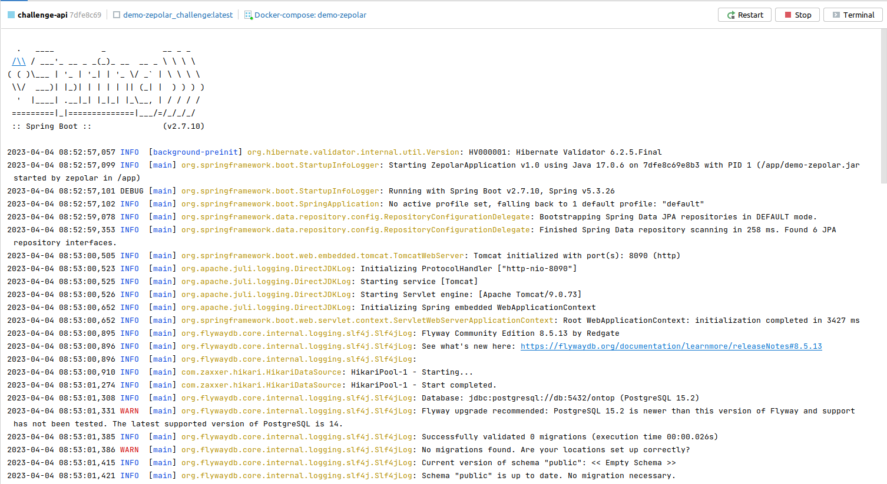
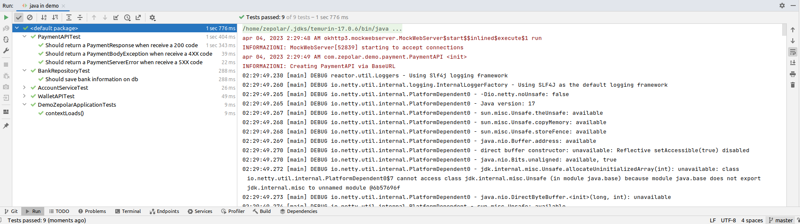
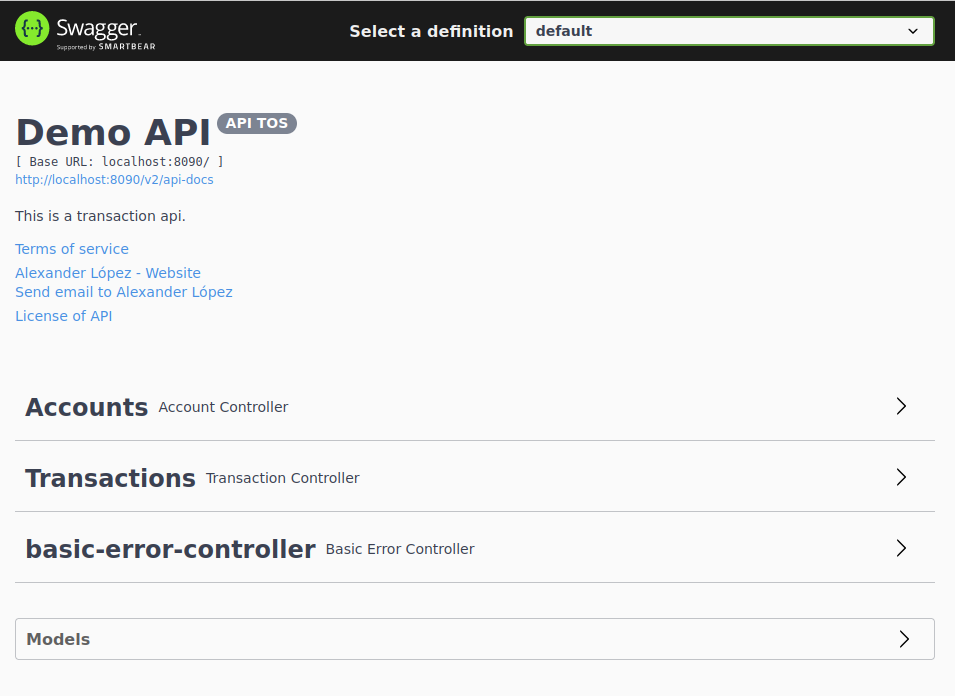
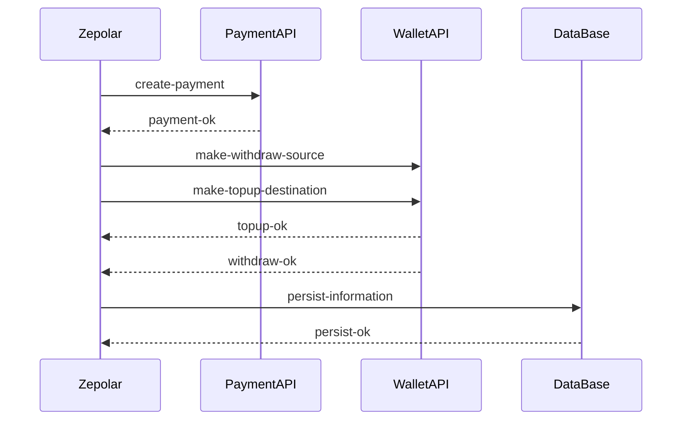

# Challenge
The idea of the challenge is to show programming skills using best practices. For them we have used clean-code as well as for the calls to external api, we have used spring-react.

## Frameworks and Tools
To complete this challenge, I decided to make it with [Spring-Boot](https://start.spring.io/), since this framework allows us to build microservices in an easy and quick way. SpringBoot has a complete guide to build applications as well as it has a community that support this framework.
Moreover, the integration that this one offers is transparent with another frameworks as [Hibernate](https://hibernate.org/) to play the database. Another thing to take into account with SpringBoot is the facility to create the documentation of the endpoints, thanks to the Swagger integration.

To management the database changes, I have used flyway. This one helps us to upgrade or downgrade the changes that it should apply on the database.

Docker is another tool that I have used to complete this challenge, creating a custom image to run the python application. Taking into account the best practices to build images.

## Project Structure
    .
    ├── com.zepolar.demo            # Package name of the project.
        ├── config                  # Configuration of application
        ├── controller              # Rest Controller
        ├── entity                  # Models used to persist on db
        ├── exception               # Exceptions used in the app
        ├── payment                 # Payment API WebClient
        ├── repository              # Contains crud operations
        ├── request                 # Request files
        ├── service                 # Bussines Logic
        ├── wallet                  # Wallet API WebClient
    ├── resouces                    # Setting configuration of app.
    ├── test                        # Test set
    ├── README.md                   
    ├── Dockerfile                  # To create the docker app image
    ├── docker-compose.yml          # To run the container set
    └── pom.xml                     # Contains the dependencies necessary to run the application.
## How to run the project
To run the application, the following software is required:

- docker, version 23.0.1,
- docker-compose, version 1.27.4

In the project, there are various env files that are necessary to run the app.

- api.env, contains information regarding application start up
- db.env, contains information with regard to database

To run the application, it just types the command:
```sh
mvn clean package #To clean and build the project to create the jar file.
docker-compose build #To build the image docker to challenge
docker-compose up #To start up both database and python application
```
The output should be as shown below:

## Running test

For running unit tests, there are two approaches. The first one is using an ide, in my case I am using IntelliJ IDEA which allows to run unit tests with one click. The second approach is through the mvn test command, using the prompt.
## Swagger
To access the documentation generated by swagger, go to http://localhost:8090/swagger-ui/index.html.

Using this interface, some operations can be executed.


## How to use the application
I understand that the application is already populated and to make a transaction it is only necessary to have the source account and the destination account.
The application only accepts: USD, COP, EUR, RUB as currencies. And there is no exchange rate validation, if the source currency is different from the target currency.
A [json](Zepolar.postman_collection.json) is provided, so it can be uploaded via posstman.
In case of using swagger, this is a valid payload.
```json
{
  "amount": 1000,
  "destinationCurrency": "USD",
  "destinationNumber": "1885226711",
  "sourceCurrency": "USD",
  "sourceNumber": "0245253419"
}
```
It is possible to do a hit to our endpoint using curl
```sh
curl --location 'http://localhost:8090/transactions' \
--header 'Content-Type: application/json' \
--data '{
"amount": 1000,
"destinationCurrency": "USD",
"destinationNumber": "1885226711",
"sourceCurrency": "USD",
"sourceNumber": "0245253419"
}'
```

## Sequence Diagram
The sequence diagram below shows how **ZepolarApp** interacts with the two external APIs: PaymentAPI and WalletAPI. Each of them handles different codes, for which it was necessary to map them and log the error. All the errors that were generated are treated as RuntimeException, as they allow us to rollback DB operations that have not yet been confirmed. And it allows to break the sequence that is presented.


## Troubleshooting
- `Challenge API` does not retrieve information from database. This one could be owing to incorrect credentials. These are set up both api.env and db.env files. Review if both files had the same credentials. Remember if it changes the credentials on database, it should recreate the container to these one take effect on new container.